---
## Front matter
title: "Отчёт по лабораторной работе №4"
subtitle: "Архитектура вычислительных систем"
author: "Савурская Полина Александровна"

## Generic otions
lang: ru-RU
toc-title: "Содержание"

## Bibliography
bibliography: bib/cite.bib
csl: pandoc/csl/gost-r-7-0-5-2008-numeric.csl

## Pdf output format
toc: true # Table of contents
toc-depth: 2
lof: true # List of figures
lot: false # List of tables
fontsize: 12pt
linestretch: 1.5
papersize: a4
documentclass: scrreprt
## I18n polyglossia
polyglossia-lang:
  name: russian
  options:
	- spelling=modern
	- babelshorthands=true
polyglossia-otherlangs:
  name: english
## I18n babel
babel-lang: russian
babel-otherlangs: english
## Fonts
mainfont: PT Serif
romanfont: PT Serif
sansfont: PT Sans
monofont: PT Mono
mainfontoptions: Ligatures=TeX
romanfontoptions: Ligatures=TeX
sansfontoptions: Ligatures=TeX,Scale=MatchLowercase
monofontoptions: Scale=MatchLowercase,Scale=0.9
## Biblatex
biblatex: true
biblio-style: "gost-numeric"
biblatexoptions:
  - parentracker=true
  - backend=biber
  - hyperref=auto
  - language=auto
  - autolang=other*
  - citestyle=gost-numeric
## Pandoc-crossref LaTeX customization
figureTitle: "Рис."
tableTitle: "Таблица"
listingTitle: "Листинг"
lofTitle: "Список иллюстраций"
lotTitle: "Список таблиц"
lolTitle: "Листинги"
## Misc options
indent: true
header-includes:
  - \usepackage{indentfirst}
  - \usepackage{float} # keep figures where there are in the text
  - \floatplacement{figure}{H} # keep figures where there are in the text
---

# Цель работы

Освоение процедуры компиляции и сборки программ, написанных на ассем-
блере NASM.

# Задание

1. В каталоге ~/work/arch-pc/lab05 с помощью команды cp создайте копию
файла hello.asm с именем lab5.asm
2. С помощью любого текстового редактора внесите изменения в текст про-
граммы в файле lab5.asm так, чтобы вместо Hello world! на экран выво-
дилась строка с вашими фамилией и именем.
3. Оттранслируйте полученный текст программы lab5.asm в объектный
файл. Выполните компоновку объектного файла и запустите получивший-
ся исполняемый файл.
4. Скопируйте файлы hello.asm и lab5.asm в Ваш локальный репозиторий
в каталог ~/work/study/2022-2023/"Архитектура компьютера"/arch-
pc/labs/lab05/. Загрузите файлы на Github.

# Выполнение лабораторной работы
Создадим каталог для работы с программами на языке ассемблера NASM с помощью команды mkdir ~/work/arch-pc/lab04 (рис. [-@fig:001])

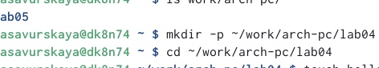{ #fig:001 width=95% }

В созданном каталоге создаем текстовый файл с именем hello.asm с помощью команды touch hello.asm. Откроем этот файл с помощью текстового редактора, например, gedit ( команда gedit hello.asm). После введем текст,данный в шаблоне выполнения Л/Р. (рис. [-@fig:002])

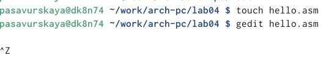{ #fig:002 width=95% }

NASM превращает текст программы в объектный код. Для компиляции приведённого выше текста программы «Hello World» необходимо написать команду nasm -f elf hello.asm (рис. [-@fig:003])

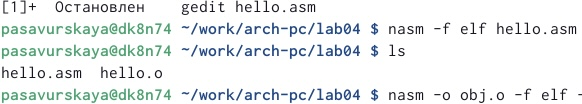{ #fig:003 width=95% }

Выполним следующую команду: nasm -o obj.o -f elf -g -l list.lst hello.asm. Данная команда скомпилирует исходный файл hello.asm в obj.o. С помощью команды ls проверим, что файлы были созданы. (рис. [-@fig:004])

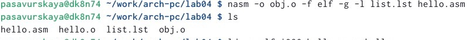{ #fig:004 width=95% }

Объектный файл необходимо передать на обработку компоновщику командой ld -m elf_i386 hello.o -o hello.С помощью команды ls проверим, что исполняемый файл hello был создан. Выполним следующую команду:
ld -m elf_i386 obj.o -o main и проверим ее выполнение с помощью команды ls (рис. [-@fig:005])

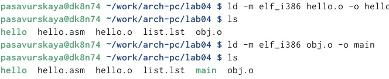{ #fig:005 width=95% }

Запустим на выполнение созданный исполняемый файл, находящийся в текущем каталоге набрав в командной строке: ./hello (рис. [-@fig:006])
 
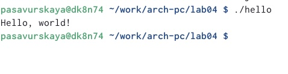{ #fig:006 width=95% }

## Самостоятельная работа.

В каталоге ~/work/arch-pc/lab04 с помощью команды cp создайте копию файла hello.asm с именем lab4.asm (рис. [-@fig:007])

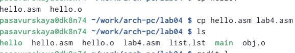{ #fig:007 width=95% }

С помощью любого текстового редактора (я использую gedit) внесем изменения в текст программы в файле lab4.asm так, чтобы вместо Hello world! на экран выводилась строка с вашими фамилией и именем. (рис. [-@fig:008])

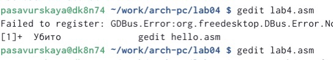{ #fig:008 width=95% }

Оттранслируем полученный текст программы lab4.asm в объектный файл. Выполним компоновку объектного файла и запустим получившийся исполняемый файл c помощью команд, которые мы использовали ранее. (рис. [-@fig:009])

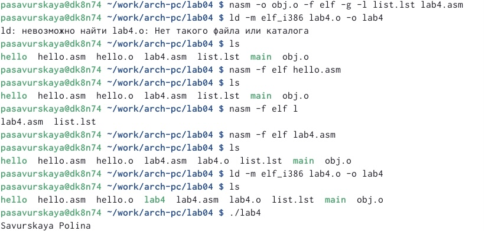{ #fig:009 width=95% }

Скопируем файлы hello.asm и lab4.asm в локальный репозиторий в каталог ~/work/study/2022-2023/"Архитектура компьютера"/arch-pc/labs/lab04/. (рис. [-@fig:010])

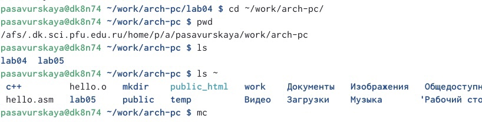{ #fig:010 width=95% }

Загрузим файлы на Github. (рис. [-@fig:011])

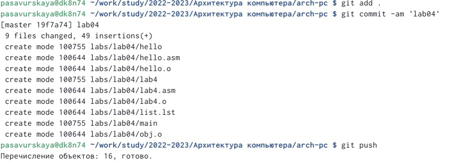{ #fig:011 width=95% }

# Выводы

Я освоила процедуры компиляции и сборки программ, написанных на ассемблере NASM.

