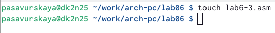

---
## Front matter
title: "Лабораторная работа №6"
subtitle: "Архитектура вычислительных систем"
author: "Савурская Полина Александровна"

## Generic otions
lang: ru-RU
toc-title: "Содержание"

## Bibliography
bibliography: bib/cite.bib
csl: pandoc/csl/gost-r-7-0-5-2008-numeric.csl

## Pdf output format
toc: true # Table of contents
toc-depth: 2
lof: true # List of figures
fontsize: 12pt
linestretch: 1.5
papersize: a4
documentclass: scrreprt
## I18n polyglossia
polyglossia-lang:
  name: russian
  options:
	- spelling=modern
	- babelshorthands=true
polyglossia-otherlangs:
  name: english
## I18n babel
babel-lang: russian
babel-otherlangs: english
## Fonts
mainfont: PT Serif
romanfont: PT Serif
sansfont: PT Sans
monofont: PT Mono
mainfontoptions: Ligatures=TeX
romanfontoptions: Ligatures=TeX
sansfontoptions: Ligatures=TeX,Scale=MatchLowercase
monofontoptions: Scale=MatchLowercase,Scale=0.9
## Biblatex
biblatex: true
biblio-style: "gost-numeric"
biblatexoptions:
  - parentracker=true
  - backend=biber
  - hyperref=auto
  - language=auto
  - autolang=other*
  - citestyle=gost-numeric
## Pandoc-crossref LaTeX customization
figureTitle: "Рис."
listingTitle: "Листинг"
lofTitle: "Список иллюстраций"
lolTitle: "Листинги"
## Misc options
indent: true
header-includes:
  - \usepackage{indentfirst}
  - \usepackage{float} # keep figures where there are in the text
  - \floatplacement{figure}{H} # keep figures where there are in the text
---

# Цель работы

Освоение арифметических инструкций языка ассемблера NASM.

# Задание

Написать программу вычисления выражения y=f(x). Программа должна выводить выражение для вычисления, выводить запрос на ввод значения x, вычислять заданное выражение в зависимости от введенного x, выводить результат вычислений. Вид функции f(x) выбрать из таблицы 6.3 вариантов заданий в соответствии с номером полученным при выполнении лабораторной работы. Создайте исполняемый файл и проверьте его работу для значений x1 и x2 из 6.3

# Теоретическое введение

Здесь описываются теоретические аспекты, связанные с выполнением работы.

Например, в табл. [-@tbl:std-dir] приведено краткое описание стандартных каталогов Unix.

: Описание некоторых каталогов файловой системы GNU Linux {#tbl:std-dir}

| Имя каталога | Описание каталога                                                                                                          |
|--------------|----------------------------------------------------------------------------------------------------------------------------|
| `/`          | Корневая директория, содержащая всю файловую                                                                               |
| `/bin `      | Основные системные утилиты, необходимые как в однопользовательском режиме, так и при обычной работе всем пользователям     |
| `/etc`       | Общесистемные конфигурационные файлы и файлы конфигурации установленных программ                                           |
| `/home`      | Содержит домашние директории пользователей, которые, в свою очередь, содержат персональные настройки и данные пользователя |
| `/media`     | Точки монтирования для сменных носителей                                                                                   |
| `/root`      | Домашняя директория пользователя  `root`                                                                                   |
| `/tmp`       | Временные файлы                                                                                                            |
| `/usr`       | Вторичная иерархия для данных пользователя                                                                                 |

Более подробно об Unix см. в [@gnu-doc:bash;@newham:2005:bash;@zarrelli:2017:bash;@robbins:2013:bash;@tannenbaum:arch-pc:ru;@tannenbaum:modern-os:ru].

# Выполнение лабораторной работы

1. Создаем каталог для программ лабораторной работы No 6, переходим в него и создадим файл lab6-1.asm (рис. [-@fig:001])

{ #fig:001 width=90% }

2. Введем в файл текст программы из листнинга, с помощью команды mc (рис. [-@fig:002])

{ #fig:002 width=75% }

3. Создадим исполняемый файл и запустим его (рис. [-@fig:003])

{ #fig:003 width=90% }

4. Изменим текст программы (нужно убрать кавычки) (рис. [-@fig:004])

{ #fig:004 width=75% }

5. Запускаем файл lab6-1. Как и в предыдущем случае, при исполнее программы мы не получили число 10. Символ под номером 10 в таблице ASCII выглядит так. Он не отобразился на экране. (рис. [-@fig:005]) (рис. [-@fig:006])

{ #fig:005 width=90% }

{ #fig:006 width=90% }

6. Создаем файл lab6-2.asm в каталоге ~/work/arch-pc/lab06 и вводим в него текст программы из листинга 7.2. (рис. [-@fig:007]) (рис. [-@fig:008])

{ #fig:007 width=90% }

{ #fig:008 width=75% }

7. Создадим исполняемый файл и запустим его (рис. [-@fig:009])

{ #fig:009 width=90% }

8. Снова изменим текст программы (нужно убрать кавычки) (рис. [-@fig:010])

{ #fig:010 width=75% }

9. Создадим исполняемый файл и запустим его. В результате на экран выводится 10 (рис. [-@fig:011])

{ #fig:011 width=90% }

10. Заменим функцию iprintLF на iprint. Создаем исполняемый файл и запустим его. Отличие в том, что LF отвечает за пропуск строки. Между строками нет разделения (рис. [-@fig:012]) (рис. [-@fig:013])

{ #fig:012 width=75% }

{ #fig:013 width=90% }

11. Создаем файл lab6-3.asm в каталоге ~/work/arch-pc/lab06 (рис. [-@fig:014])

{ #fig:014 width=90% }

12. Вводим в файл lab6-3.asm текст из листинга 3 (рис. [-@fig:015])

{ #fig:015 width=75% }

13. Запускаем файл lab6-3.asm (рис. [-@fig:016])

{ #fig:016 width=90% }

14. Изменим текст программы чтобы получить другой результат. Проверим правильность нашей работы путем запуска измененного файла (рис. [-@fig:017])

{ #fig:017 width=90% }

15. Создадим файл variant.asm в каталоге ~/work/arch-pc/lab06 (рис. [-@fig:018])

{ #fig:018 width=90% }

16. Вводим в файл текст из листинга 4 и запускаем файл (рис. [-@fig:019])

{ #fig:019 width=90% }

#Ответы на вопросы

1. Какие строки листинга 7.4 отвечают за вывод на экран сообщения ‘Ваш вариант:’? 
Строчка rem: DB 'Ваш вариант: ',0 отвечает за вывод сообщения.

2. Для чего используется следующие инструкции? 
nasm mov ecx, x mov edx, 80 call sread

3. Для чего используется инструкция “call atoi”? 
Функция call atoi преобразует ascii-код символа в целое число и записывает результат в регистр eax.

4. Какие строки листинга 7.4 отвечают за вычисления варианта?
mov eax, msg
call sprintLF

5. В какой регистр записывается остаток от деления при выполнении инструкции “div ebx”?
Остаток записывается в регистр ah.
 
6. Для чего используется инструкция “inc edx”? 
Команда inc edx увеличивает значение регистра edx на 1.

7. Какие строки листинга 7.4 отвечают за вывод на экран результата вычислений?
mov eax,rem
call sprint
mov eax,edx
call iprintLF
call quit

# Выводы

Я освоила арифметические инструкции языка ассемблера NASM.

